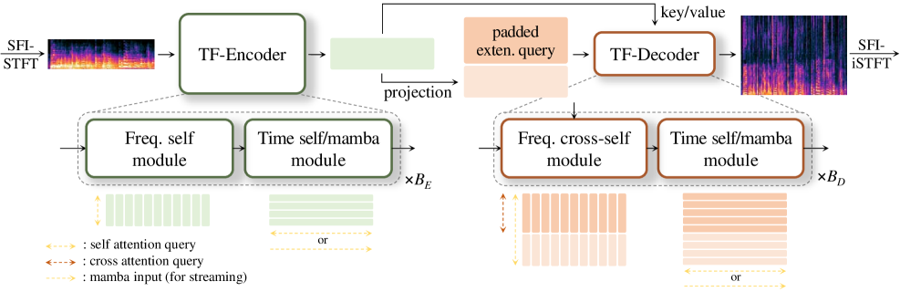

# TF-Restormer for Speech Restoration (ICML 2026)

Time-Frequency domain Restormer for speech restoration.
[[Paper (arXiv)]](https://arxiv.org/abs/2509.21003) [[Demo]](https://tf-restormer.github.io/demo/)

## Overview

TF-Restormer is a query-based asymmetric modeling framework for speech restoration under decoupled input-output sampling rates. The encoder concentrates analysis on the observed input bandwidth using a time-frequency dual-path architecture, while a lightweight decoder reconstructs missing spectral content via frequency extension queries. This design enables a single model to operate consistently across arbitrary input-output rate pairs without redundant resampling. Two model variants are available:

- **Offline** (attention) — non-causal, higher quality
- **Online** (Mamba SSM) — causal streaming, low latency

<p align="center">
  
</p>

## Installation

**Requirements**: Python 3.10+

### Library users (pip)

For using TF-Restormer as a library in your own project. Requires PyTorch pre-installed in your environment.

```bash
# From local source
git clone https://github.com/shinuh/TF-Restormer.git
cd TF-Restormer
pip install -e .                # inference only
pip install -e ".[hub]"         # + HF Hub support
pip install -e ".[mamba]"       # + streaming model (Mamba)
```

> **NOTE**: PyTorch is **not** included — install it separately via [pytorch.org](https://pytorch.org/get-started/locally/) to match your CUDA version.

> **Future**: once published to PyPI, `pip install tf-restormer` (with optional extras `[hub]` / `[mamba]`) will install the package without cloning.

### Development / CLI (uv)

For training, evaluation, and running `run.py` directly. Uses [uv](https://docs.astral.sh/uv/) for dependency management with conflict-safe PyTorch index routing.

```bash
git clone https://github.com/shinuh/TF-Restormer.git
cd TF-Restormer

uv sync --extra cu124                              # CUDA 12.4 inference
uv sync --extra cu124 --extra train                # + training dependencies
uv sync --extra cu124 --extra train --extra mamba  # + streaming model (Mamba)
uv sync --extra cpu                                # CPU-only

source .venv/bin/activate
```

> **NOTE**: Do not use `uv sync --extra train` alone — always combine with an accelerator extra (`cu124`/`cu126`/`cpu`).

## Quick Start

### Python API

```python
from tf_restormer import SEInference

# Load from Hugging Face Hub
model = SEInference.from_pretrained(
    checkpoint_path="shinuh/tf-restormer-baseline",
    device="cuda",
)

# Restore a file (fs_in auto-detected from file)
# `fs_out` is optional — defaults to the model's training output rate (typically 48000).
result = model.process_file("noisy_16k.wav", output_path="restored.wav", fs_out=48000)
# result["waveform"]    -> (1, L) tensor at 48 kHz
# result["sample_rate"] -> 48000

# Or restore a waveform tensor directly (fs_in is required — native input rate)
import torch
waveform = torch.randn(1, 16000)  # (1, L) at 16 kHz
result = model.process_waveform(waveform, fs_in=16000, fs_out=48000)
```

For STFT-domain I/O, chunk-by-chunk streaming, or session-based processing, see the [Library API](#library-api) section below.

### CLI

> CLI examples below use `uv run`. If you have already activated the venv (`source .venv/bin/activate`), drop the `uv run` prefix.

```bash
# Restore a single file
uv run python run.py --model TF_Restormer --engine_mode infer --config baseline.yaml \
    --input noisy.wav --output restored/

# Restore all files in a directory
uv run python run.py --model TF_Restormer --engine_mode infer --config baseline.yaml \
    --input noisy_dir/ --output restored/
```

## Pretrained Models

Pretrained checkpoints will be available on [Hugging Face Hub](https://huggingface.co/shinuh) soon.

| Model | Repo ID | Input | Output | Description |
|---|---|---|---|---|
| Offline | `shinuh/tf-restormer-baseline` | 16 kHz | 48 kHz | Non-causal, attention-based |
| Online | `shinuh/tf-restormer-streaming` | 16 kHz | 48 kHz | Mamba SSM, causal streaming |

> **Recommendation**: For best results, feed audio at its **native sample rate** (e.g., 16 kHz) rather than pre-upsampling. The model automatically detects the effective bandwidth and applies frequency extension accordingly. Pre-upsampled input (e.g., 16 kHz content resampled to 48 kHz) is handled via built-in band detection, but providing the native rate avoids unnecessary processing.

## Examples

See [`library_examples/`](library_examples/) for complete runnable scripts:

| Script | Description |
|---|---|
| `basic_inference.py` | Load a model and restore a single file |
| `batch_inference.py` | Restore all `.wav` files in a directory |
| `streaming_inference.py` | Chunk-by-chunk streaming inference |
| `config_override.py` | Override config values; HF Hub loading |
| `eval_metrics.py` | Compute PESQ/STOI/DNSMOS/NISQA standalone (uses `tf_restormer.utils.metrics`) |

## Library API

For programmatic inference — load a model and process audio in Python code. Supports local checkpoints and Hugging Face Hub downloads.

### Model Loading

```python
from tf_restormer import SEInference

# Load from local checkpoint
model = SEInference.from_pretrained(
    config="baseline.yaml",
    checkpoint_path="path/to/checkpoint/",
    device="cuda",
)

# Or load from Hugging Face Hub (requires: pip install -e ".[hub]")
model = SEInference.from_pretrained(
    checkpoint_path="shinuh/tf-restormer-baseline",
    device="cuda",
)
```

### Batch Processing

Single-call APIs that consume the whole input at once. The three `process_*` methods are arranged from **highest abstraction (file I/O)** to **lowest (STFT domain)**, so you can pick the level that matches your pipeline.

#### Level 1: File I/O (`process_file`)

```python
# Loads audio at native sample rate (fs_in auto-detected from file)
# `fs_out` is optional — defaults to the model's training output rate (typically 48000).
result = model.process_file("noisy_16k.wav", output_path="restored.wav", fs_out=48000)
# result["waveform"]    -> (1, L) tensor at 48 kHz
# result["sample_rate"] -> 48000
```

> Input files should be at their **native sample rate** (not pre-upsampled). The model handles bandwidth extension internally.

#### Level 2: Waveform Tensor (`process_waveform`)

```python
import torch
waveform = torch.randn(1, 16000)  # (1, L) at 16 kHz

# `mode` selects the chunking strategy: 'auto' (default) | 'single_pass' | 'css'
# fs_in and fs_out — input/output sample rates
# Auto mode: single-pass for short audio, chunked overlap-add for long audio
result = model.process_waveform(waveform, fs_in=16000, fs_out=48000)
# result["waveform"] -> (1, L_out) at 48 kHz

# Force single-pass or chunked mode
result = model.process_waveform(waveform, fs_in=16000, fs_out=48000, mode="single_pass")
result = model.process_waveform(waveform, fs_in=16000, fs_out=48000, mode="css")
```

#### Level 3: Full STFT (`process_stft`)

```python
# STFT in, STFT + waveform out — for pipelines that manage STFT themselves
# fs_in is required — must match the rate the STFT was computed at
stft_input = model.get_stft(16000)(waveform, cplx=True)  # (1, F, T) complex
result = model.process_stft(stft_input, fs_in=16000, fs_out=48000)
# result["stft_out"] -> (1, F_out, T) complex tensor
# result["waveform"] -> (1, L_out) float tensor

# iSTFT separately if needed
out_wav = model.get_istft(48000)(result["stft_out"], cplx=True, squeeze=True)
```

> **Sample-rate resolution policy**: `process_file`, `process_waveform`, `process_stft`, and `create_session` use **strict** matching against the model's `fs_list` (training-time supported rates) and raise `ValueError` for unsupported rates. The lower-level `get_stft(fs)` / `get_istft(fs)` accessors fall back to the nearest available rate — use them only when you understand the trade-off.

### Session-based Processing (`create_session`)

For chunk-by-chunk control — supports both batch accumulation and real-time streaming patterns. The session handles STFT-domain chunking with context windows (history + future frames around each body), producing higher-quality chunk boundaries than naive waveform-level overlap-add.

#### Batch (manual chunking with overlap-add)

```python
session = model.create_session(fs_in=16000, fs_out=48000, streaming=False)

# In batch mode, feed_waveform's return value can be ignored; finalize()
# produces the full reconstructed waveform via the internal stitcher.
for chunk in audio_chunks:
    session.feed_waveform(chunk)

# Get the complete overlap-add result
result = session.finalize()
# result["waveform"] -> (1, L_out) full enhanced waveform
```

#### Waveform Streaming

See [`library_examples/streaming_inference.py`](library_examples/streaming_inference.py) for a complete runnable streaming example.

Feed raw PCM samples and receive enhanced chunks immediately.

```python
# fs_in is required in create_session; feed_waveform does not take fs_in
session = model.create_session(fs_in=16000, fs_out=48000, streaming=True)

while stream_in.is_active():
    waveform = stream_in.read(read_size)
    # In streaming mode, feed_waveform returns list[dict] (each dict has key
    # "waveform") so chunks can be emitted live without waiting for finalize().
    results = session.feed_waveform(waveform)
    for r in results:
        stream_out.write(r["waveform"])  # (1, L_chunk) enhanced chunk

# Flush remaining buffered samples
drained, tail = session.flush()
for r in drained:
    stream_out.write(r["waveform"])
if tail is not None:
    stream_out.write(tail["waveform"])
```

#### Custom chunk/overlap configuration

```python
# Seconds-based (auto-converted to STFT frames)
session = model.create_session(
    fs_in=16000, fs_out=48000, streaming=True,
    css_config={"chunk_sec": 4.0, "overlap_sec": 0.5},
)

# Or direct STFT-frame control (frame-form keys are honoured by
# process_waveform / EngineInfer.infer_session, not by create_session)
# noisy: (1, L) waveform from earlier example
result = model.process_waveform(
    noisy, fs_in=16000, fs_out=48000,
    mode="css",
    css_config={"N_h": 25, "N_c": 150, "N_f": 25},
)
```

> **Note**: `create_session` honours only the seconds-form keys (`chunk_sec`, `overlap_sec`) inside `css_config`. The frame-form keys (`N_h`, `N_c`, `N_f`) are accepted by `EngineInfer.infer_session()` (used by `process_waveform`) but are silently ignored by `InferenceSession`. Use `process_waveform(..., mode="css", css_config={"N_h": ..., "N_c": ..., "N_f": ...})` for direct frame-level control. (Subject to change in a future release — the frame-form keys may be wired into `InferenceSession` directly.)

## Training & Evaluation

### Data Preparation

Training requires SCP (script) files that map utterance keys to audio file paths.

```bash
# Generate SCP files for specific datasets
uv run python data/create_scp/create_scp_VCTK.py
uv run python data/create_scp/create_scp_libriTTS_R.py
uv run python data/create_scp/create_scp_noise.py
```

Before training, set `db_root` and `rir_dir` in
`tf_restormer/models/TF_Restormer/configs/baseline.yaml`:

```yaml
dataset:
    db_root: /path/to/your/dataset   # e.g. /home/DB/VCTK
    rir_dir: /path/to/DNS_RIR_48k    # e.g. /home/DB/DNS_RIR_48k
```

Generated SCP files are saved to `data/scp/` and referenced by training configs.

The `scp_dir` field in the same YAML config (e.g. `data/scp/scp_VCTK`) points to the SCP files generated above.

> **SCP path resolution**: `scp_dir` is resolved **relative to the current working directory** when training/inference is launched. Run `run.py` from the repo root, or set `scp_dir` to an absolute path when invoking from elsewhere (e.g. after `pip install tf-restormer`).

### Run Training

```bash
uv run python run.py --model TF_Restormer --engine_mode train --config baseline.yaml
```

Available configs: `baseline.yaml` (offline), `streaming.yaml` (online/Mamba).

### Inference / Evaluation on Test Sets

When `--input` is omitted, inference runs on test sets defined in the config (`dataset_test.testset_key`).

```bash
# Inference on config-defined test sets
uv run python run.py --model TF_Restormer --engine_mode infer --config baseline.yaml

# Optional: redirect dump output to a custom directory
uv run python run.py --model TF_Restormer --engine_mode infer --config baseline.yaml \
    --dump_path /path/to/dumps/

# Compute metrics (PESQ, STOI, DNSMOS, etc.)
uv run python run.py --model TF_Restormer --engine_mode eval --config baseline.yaml
```

### Checkpoint Management

Export, upload, and download checkpoints via `tf_restormer/export.py`.
Requires `uv sync --extra hub` for Hugging Face upload/download.

> **⚠️ Repo namespace**: the official maintainer publishes under the `shinuh/` HF organisation. When you train and upload your own checkpoints, replace `shinuh/...` with your own HF account or organisation name (e.g., `--repo-id youraccount/tf-restormer-baseline`).
>
> **Important caveats**:
> - `--upload`: **always pass `--epoch N` and `--repo-id youraccount/...`**. The explicit epoch prevents a release from silently selecting the latest training checkpoint. Omitting the repo ID auto-generates `<whoami>/tf-restormer-<config>`.
> - `--upload-all`: **does not yet support namespace override** — it always targets `shinuh/...` (tracked as P2-13 code-route fix). Until fixed, upload your own checkpoints individually with `--upload --repo-id youraccount/...`.

```bash
# Export an exact trained checkpoint (strip optimizer state for deployment)
uv run python tf_restormer/export.py --config baseline.yaml --epoch 19

# Upload to Hugging Face Hub
uv run python tf_restormer/export.py --config baseline.yaml --epoch 19 --upload --repo-id shinuh/tf-restormer-baseline

# Upload all locally exported checkpoints
uv run python tf_restormer/export.py --upload-all

# Download from Hugging Face Hub
uv run python tf_restormer/export.py --download --repo-id shinuh/tf-restormer-baseline
```

## Project Structure

```
TF_Restormer_release/
  run.py                            # CLI entry point
  tf_restormer/
    inference.py                    # Public API (SEInference, InferenceSession)
    export.py                       # Checkpoint export and HF Hub upload utilities
    _config.py                      # Config loading helpers
    models/
      TF_Restormer/
        model.py                    # Model definition
        engine.py                   # Train/test loops
        engine_infer.py             # Tensor-in / tensor-out inference engine
        engine_eval.py              # Evaluation engine with metric aggregation
        modules/                    # network.py (TF blocks, attention) + module.py
        configs/                    # Per-experiment YAML config files
    utils/                          # STFT, metrics, checkpoints, dataset utilities
  library_examples/                 # Library API usage examples
  data/                             # SCP generation scripts
```

## Citation

If you use TF-Restormer in your research, please cite:

```bibtex
@article{tfrestormer2025,
  title   = {Query-Based Asymmetric Modeling with Decoupled Input-Output Rates for Speech Restoration},
  author  = {Shin, Ui-Hyeop and Ko, Jaehyun and Jeong, Woocheol and Park, Hyung-Min},
  journal = {arXiv preprint arXiv:2509.21003},
  year    = {2025},
}
```
